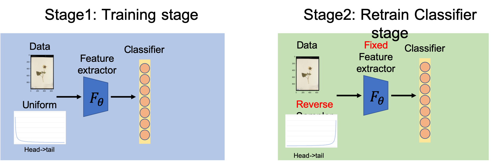

This repository is the 4th solution for competition [Herbarium 2020 - FGVC7](https://www.kaggle.com/c/herbarium-2020-fgvc7/overview)
# Methods
our method mainly refers the paper [A CLOSER LOOK AT FEW-SHOT CLASSIFICATION](https://arxiv.org/pdf/1904.04232.pdf) and requires 2 stage training, and we do a little change to get the best result
1. we use 448 * 448 for training and test
2. we use seresnext50 as our backbone compared with senet154, se_resnet152
3. we add half crop in image aug stage
4. we do not use cosine distance because cosine distance leads to slow converge  and low presion 
5. we remove No.23079 class in train and test



# Requirement

1. install [apex](https://github.com/NVIDIA/apex) for distributed training support
2. install requirements
```angular2
# install requirements
pip3 install -r reequirements.txt --user
```
# Usage

```
# To train stage 1
python3 -m torch.distributed.launch --nproc_per_node 8 train.py -c config.s1.yaml

# To train stage 2
python3 -m torch.distributed.launch --nproc_per_node 8 train.py -c config.s2.yaml
```

# TODO
* test code
